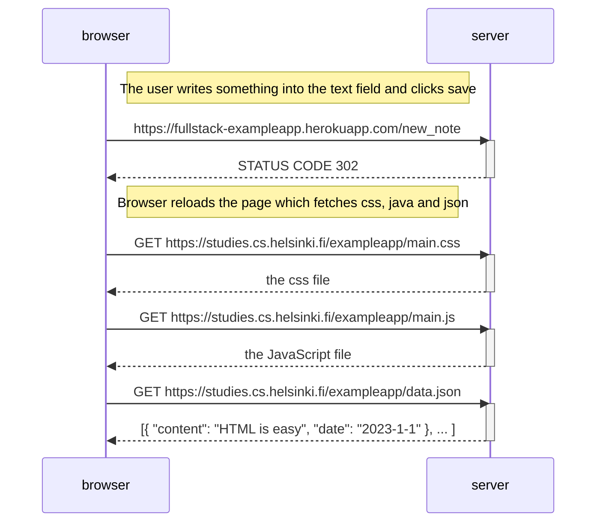

```mermaid
sequenceDiagram
    participant browser
    participant server
    
    Note right of browser: The user writes something into the text field and clicks save
    browser->>server: https://fullstack-exampleapp.herokuapp.com/new_note
    activate server
    server-->>browser: STATUS CODE 302
    deactivate server
    
    Note right of browser: Browser reloads the page which fetches css, java and json

    browser->>server: GET https://studies.cs.helsinki.fi/exampleapp/main.css
    activate server
    server-->>browser: the css file
    deactivate server

    browser->>server: GET https://studies.cs.helsinki.fi/exampleapp/main.js
    activate server
    server-->>browser: the JavaScript file
    deactivate server

    browser->>server: GET https://studies.cs.helsinki.fi/exampleapp/data.json
    activate server
    server-->>browser: [{ "content": "HTML is easy", "date": "2023-1-1" }, ... ]
    deactivate server
```