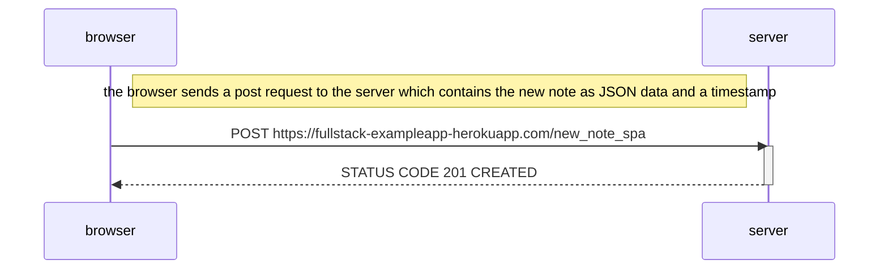

```mermaid
    sequenceDiagram
    participant browser
    participant server
    
    Note right of browser: the browser sends a post request to the server which contains the new note as JSON data and a timestamp
    
    browser->>server: POST https://fullstack-exampleapp-herokuapp.com/new_note_spa
    activate server
    server-->>browser: STATUS CODE 201 CREATED
    deactivate server
```